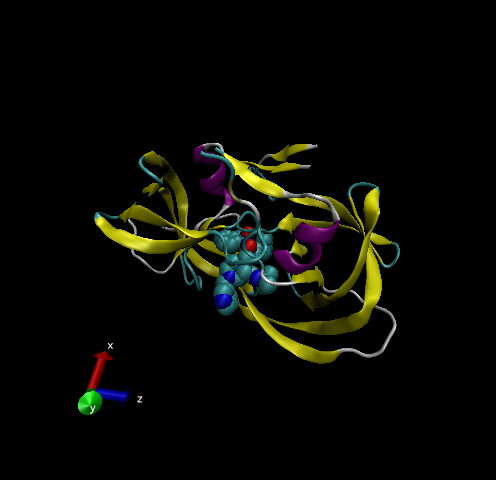

```{r}
db<-read.csv("Data Export Summary.csv", row.names=1)
head(db)
```

> Q1: What percentage of structures in the PDB are solved by X-Ray and Electron Microscopy?

```{r}
method.sums<-colSums(db)
round((method.sums/method.sums["Total"])*100,2)
```

> Q2: What proportion of structures in the PDB are protein?

```{r}
round((db$Total/method.sums["Total"])*100,2)
```

> Q3: Type HIV in the PDB website search box on the home page and determine how many HIV-1 protease structures are in the current PDB? 1828 Structures

## VMD Structure Visualization Image

> Q4: Water molecules normally have 3 atoms. Why do we see just one atom per water molecule in this structure? Because they are so small

> Q5: There is a conserved water molecule in the binding site. Can you identify this water molecule? What residue number does this water molecule have (see note below)?




#Section 3
#Using Bio3D

```{r}
library(bio3d)

pdb<- read.pdb("1HSG")
pdb
```
```{r}
pdbseq(pdb)
aa321(pdbseq(pdb))
```

Plot of B-factor

```{r}
plot.bio3d(pdb$atom$b, sse=pdb)
```

The ATOM Records

```{r}
head(pdb$atom)
```

