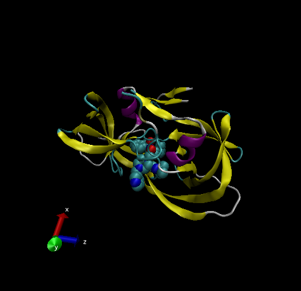

Class 11
================
Byanca Lima Valenzuela (A16688058)

``` r
db<-read.csv("Data Export Summary.csv", row.names=1)
head(db)
```

    ##                          X.ray   NMR   EM Multiple.methods Neutron Other  Total
    ## Protein (only)          142303 11804 5999              177      70    32 160385
    ## Protein/Oligosaccharide   8414    31  979                5       0     0   9429
    ## Protein/NA                7491   274 1986                3       0     0   9754
    ## Nucleic acid (only)       2368  1372   60                8       2     1   3811
    ## Other                      149    31    3                0       0     0    183
    ## Oligosaccharide (only)      11     6    0                1       0     4     22

> Q1: What percentage of structures in the PDB are solved by X-Ray and
> Electron Microscopy?

``` r
method.sums<-colSums(db)
round((method.sums/method.sums["Total"])*100,2)
```

    ##            X.ray              NMR               EM Multiple.methods 
    ##            87.55             7.36             4.92             0.11 
    ##          Neutron            Other            Total 
    ##             0.04             0.02           100.00

> Q2: What proportion of structures in the PDB are protein?

``` r
round((db$Total/method.sums["Total"])*100,2)
```

    ## [1] 87.36  5.14  5.31  2.08  0.10  0.01

> Q3: Type HIV in the PDB website search box on the home page and
> determine how many HIV-1 protease structures are in the current PDB?
> 1828 Structures

## VMD Structure Visualization Image

> Q4: Water molecules normally have 3 atoms. Why do we see just one atom
> per water molecule in this structure? Because they are so small

> Q5: There is a conserved water molecule in the binding site. Can you
> identify this water molecule? What residue number does this water
> molecule have (see note below)?



#Section 3 Introduction to Bio3D in R #Using Bio3D

``` r
library(bio3d)

pdb<- read.pdb("1HSG")
```

    ##   Note: Accessing on-line PDB file

``` r
pdb
```

    ## 
    ##  Call:  read.pdb(file = "1HSG")
    ## 
    ##    Total Models#: 1
    ##      Total Atoms#: 1686,  XYZs#: 5058  Chains#: 2  (values: A B)
    ## 
    ##      Protein Atoms#: 1514  (residues/Calpha atoms#: 198)
    ##      Nucleic acid Atoms#: 0  (residues/phosphate atoms#: 0)
    ## 
    ##      Non-protein/nucleic Atoms#: 172  (residues: 128)
    ##      Non-protein/nucleic resid values: [ HOH (127), MK1 (1) ]
    ## 
    ##    Protein sequence:
    ##       PQITLWQRPLVTIKIGGQLKEALLDTGADDTVLEEMSLPGRWKPKMIGGIGGFIKVRQYD
    ##       QILIEICGHKAIGTVLVGPTPVNIIGRNLLTQIGCTLNFPQITLWQRPLVTIKIGGQLKE
    ##       ALLDTGADDTVLEEMSLPGRWKPKMIGGIGGFIKVRQYDQILIEICGHKAIGTVLVGPTP
    ##       VNIIGRNLLTQIGCTLNF
    ## 
    ## + attr: atom, xyz, seqres, helix, sheet,
    ##         calpha, remark, call

> Q7: How many amino acid residues are there in this pdb object? 198

> Q8: Name one of the two non-protein residues? MK1

> Q9: How many protein chains are in this structure? 2

``` r
pdbseq(pdb)
```

    ##   1   2   3   4   5   6   7   8   9  10  11  12  13  14  15  16  17  18  19  20 
    ## "P" "Q" "I" "T" "L" "W" "Q" "R" "P" "L" "V" "T" "I" "K" "I" "G" "G" "Q" "L" "K" 
    ##  21  22  23  24  25  26  27  28  29  30  31  32  33  34  35  36  37  38  39  40 
    ## "E" "A" "L" "L" "D" "T" "G" "A" "D" "D" "T" "V" "L" "E" "E" "M" "S" "L" "P" "G" 
    ##  41  42  43  44  45  46  47  48  49  50  51  52  53  54  55  56  57  58  59  60 
    ## "R" "W" "K" "P" "K" "M" "I" "G" "G" "I" "G" "G" "F" "I" "K" "V" "R" "Q" "Y" "D" 
    ##  61  62  63  64  65  66  67  68  69  70  71  72  73  74  75  76  77  78  79  80 
    ## "Q" "I" "L" "I" "E" "I" "C" "G" "H" "K" "A" "I" "G" "T" "V" "L" "V" "G" "P" "T" 
    ##  81  82  83  84  85  86  87  88  89  90  91  92  93  94  95  96  97  98  99   1 
    ## "P" "V" "N" "I" "I" "G" "R" "N" "L" "L" "T" "Q" "I" "G" "C" "T" "L" "N" "F" "P" 
    ##   2   3   4   5   6   7   8   9  10  11  12  13  14  15  16  17  18  19  20  21 
    ## "Q" "I" "T" "L" "W" "Q" "R" "P" "L" "V" "T" "I" "K" "I" "G" "G" "Q" "L" "K" "E" 
    ##  22  23  24  25  26  27  28  29  30  31  32  33  34  35  36  37  38  39  40  41 
    ## "A" "L" "L" "D" "T" "G" "A" "D" "D" "T" "V" "L" "E" "E" "M" "S" "L" "P" "G" "R" 
    ##  42  43  44  45  46  47  48  49  50  51  52  53  54  55  56  57  58  59  60  61 
    ## "W" "K" "P" "K" "M" "I" "G" "G" "I" "G" "G" "F" "I" "K" "V" "R" "Q" "Y" "D" "Q" 
    ##  62  63  64  65  66  67  68  69  70  71  72  73  74  75  76  77  78  79  80  81 
    ## "I" "L" "I" "E" "I" "C" "G" "H" "K" "A" "I" "G" "T" "V" "L" "V" "G" "P" "T" "P" 
    ##  82  83  84  85  86  87  88  89  90  91  92  93  94  95  96  97  98  99 
    ## "V" "N" "I" "I" "G" "R" "N" "L" "L" "T" "Q" "I" "G" "C" "T" "L" "N" "F"

``` r
aa321(pdbseq(pdb))
```

    ## Warning in FUN(X[[i]], ...): Unknown 3-letters code for aminoacid: P

    ## Warning in FUN(X[[i]], ...): Unknown 3-letters code for aminoacid: Q

    ## Warning in FUN(X[[i]], ...): Unknown 3-letters code for aminoacid: I

    ## Warning in FUN(X[[i]], ...): Unknown 3-letters code for aminoacid: T

    ## Warning in FUN(X[[i]], ...): Unknown 3-letters code for aminoacid: L

    ## Warning in FUN(X[[i]], ...): Unknown 3-letters code for aminoacid: W

    ## Warning in FUN(X[[i]], ...): Unknown 3-letters code for aminoacid: Q

    ## Warning in FUN(X[[i]], ...): Unknown 3-letters code for aminoacid: R

    ## Warning in FUN(X[[i]], ...): Unknown 3-letters code for aminoacid: P

    ## Warning in FUN(X[[i]], ...): Unknown 3-letters code for aminoacid: L

    ## Warning in FUN(X[[i]], ...): Unknown 3-letters code for aminoacid: V

    ## Warning in FUN(X[[i]], ...): Unknown 3-letters code for aminoacid: T

    ## Warning in FUN(X[[i]], ...): Unknown 3-letters code for aminoacid: I

    ## Warning in FUN(X[[i]], ...): Unknown 3-letters code for aminoacid: K

    ## Warning in FUN(X[[i]], ...): Unknown 3-letters code for aminoacid: I

    ## Warning in FUN(X[[i]], ...): Unknown 3-letters code for aminoacid: G

    ## Warning in FUN(X[[i]], ...): Unknown 3-letters code for aminoacid: G

    ## Warning in FUN(X[[i]], ...): Unknown 3-letters code for aminoacid: Q

    ## Warning in FUN(X[[i]], ...): Unknown 3-letters code for aminoacid: L

    ## Warning in FUN(X[[i]], ...): Unknown 3-letters code for aminoacid: K

    ## Warning in FUN(X[[i]], ...): Unknown 3-letters code for aminoacid: E

    ## Warning in FUN(X[[i]], ...): Unknown 3-letters code for aminoacid: A

    ## Warning in FUN(X[[i]], ...): Unknown 3-letters code for aminoacid: L

    ## Warning in FUN(X[[i]], ...): Unknown 3-letters code for aminoacid: L

    ## Warning in FUN(X[[i]], ...): Unknown 3-letters code for aminoacid: D

    ## Warning in FUN(X[[i]], ...): Unknown 3-letters code for aminoacid: T

    ## Warning in FUN(X[[i]], ...): Unknown 3-letters code for aminoacid: G

    ## Warning in FUN(X[[i]], ...): Unknown 3-letters code for aminoacid: A

    ## Warning in FUN(X[[i]], ...): Unknown 3-letters code for aminoacid: D

    ## Warning in FUN(X[[i]], ...): Unknown 3-letters code for aminoacid: D

    ## Warning in FUN(X[[i]], ...): Unknown 3-letters code for aminoacid: T

    ## Warning in FUN(X[[i]], ...): Unknown 3-letters code for aminoacid: V

    ## Warning in FUN(X[[i]], ...): Unknown 3-letters code for aminoacid: L

    ## Warning in FUN(X[[i]], ...): Unknown 3-letters code for aminoacid: E

    ## Warning in FUN(X[[i]], ...): Unknown 3-letters code for aminoacid: E

    ## Warning in FUN(X[[i]], ...): Unknown 3-letters code for aminoacid: M

    ## Warning in FUN(X[[i]], ...): Unknown 3-letters code for aminoacid: S

    ## Warning in FUN(X[[i]], ...): Unknown 3-letters code for aminoacid: L

    ## Warning in FUN(X[[i]], ...): Unknown 3-letters code for aminoacid: P

    ## Warning in FUN(X[[i]], ...): Unknown 3-letters code for aminoacid: G

    ## Warning in FUN(X[[i]], ...): Unknown 3-letters code for aminoacid: R

    ## Warning in FUN(X[[i]], ...): Unknown 3-letters code for aminoacid: W

    ## Warning in FUN(X[[i]], ...): Unknown 3-letters code for aminoacid: K

    ## Warning in FUN(X[[i]], ...): Unknown 3-letters code for aminoacid: P

    ## Warning in FUN(X[[i]], ...): Unknown 3-letters code for aminoacid: K

    ## Warning in FUN(X[[i]], ...): Unknown 3-letters code for aminoacid: M

    ## Warning in FUN(X[[i]], ...): Unknown 3-letters code for aminoacid: I

    ## Warning in FUN(X[[i]], ...): Unknown 3-letters code for aminoacid: G

    ## Warning in FUN(X[[i]], ...): Unknown 3-letters code for aminoacid: G

    ## Warning in FUN(X[[i]], ...): Unknown 3-letters code for aminoacid: I

    ## Warning in FUN(X[[i]], ...): Unknown 3-letters code for aminoacid: G

    ## Warning in FUN(X[[i]], ...): Unknown 3-letters code for aminoacid: G

    ## Warning in FUN(X[[i]], ...): Unknown 3-letters code for aminoacid: F

    ## Warning in FUN(X[[i]], ...): Unknown 3-letters code for aminoacid: I

    ## Warning in FUN(X[[i]], ...): Unknown 3-letters code for aminoacid: K

    ## Warning in FUN(X[[i]], ...): Unknown 3-letters code for aminoacid: V

    ## Warning in FUN(X[[i]], ...): Unknown 3-letters code for aminoacid: R

    ## Warning in FUN(X[[i]], ...): Unknown 3-letters code for aminoacid: Q

    ## Warning in FUN(X[[i]], ...): Unknown 3-letters code for aminoacid: Y

    ## Warning in FUN(X[[i]], ...): Unknown 3-letters code for aminoacid: D

    ## Warning in FUN(X[[i]], ...): Unknown 3-letters code for aminoacid: Q

    ## Warning in FUN(X[[i]], ...): Unknown 3-letters code for aminoacid: I

    ## Warning in FUN(X[[i]], ...): Unknown 3-letters code for aminoacid: L

    ## Warning in FUN(X[[i]], ...): Unknown 3-letters code for aminoacid: I

    ## Warning in FUN(X[[i]], ...): Unknown 3-letters code for aminoacid: E

    ## Warning in FUN(X[[i]], ...): Unknown 3-letters code for aminoacid: I

    ## Warning in FUN(X[[i]], ...): Unknown 3-letters code for aminoacid: C

    ## Warning in FUN(X[[i]], ...): Unknown 3-letters code for aminoacid: G

    ## Warning in FUN(X[[i]], ...): Unknown 3-letters code for aminoacid: H

    ## Warning in FUN(X[[i]], ...): Unknown 3-letters code for aminoacid: K

    ## Warning in FUN(X[[i]], ...): Unknown 3-letters code for aminoacid: A

    ## Warning in FUN(X[[i]], ...): Unknown 3-letters code for aminoacid: I

    ## Warning in FUN(X[[i]], ...): Unknown 3-letters code for aminoacid: G

    ## Warning in FUN(X[[i]], ...): Unknown 3-letters code for aminoacid: T

    ## Warning in FUN(X[[i]], ...): Unknown 3-letters code for aminoacid: V

    ## Warning in FUN(X[[i]], ...): Unknown 3-letters code for aminoacid: L

    ## Warning in FUN(X[[i]], ...): Unknown 3-letters code for aminoacid: V

    ## Warning in FUN(X[[i]], ...): Unknown 3-letters code for aminoacid: G

    ## Warning in FUN(X[[i]], ...): Unknown 3-letters code for aminoacid: P

    ## Warning in FUN(X[[i]], ...): Unknown 3-letters code for aminoacid: T

    ## Warning in FUN(X[[i]], ...): Unknown 3-letters code for aminoacid: P

    ## Warning in FUN(X[[i]], ...): Unknown 3-letters code for aminoacid: V

    ## Warning in FUN(X[[i]], ...): Unknown 3-letters code for aminoacid: N

    ## Warning in FUN(X[[i]], ...): Unknown 3-letters code for aminoacid: I

    ## Warning in FUN(X[[i]], ...): Unknown 3-letters code for aminoacid: I

    ## Warning in FUN(X[[i]], ...): Unknown 3-letters code for aminoacid: G

    ## Warning in FUN(X[[i]], ...): Unknown 3-letters code for aminoacid: R

    ## Warning in FUN(X[[i]], ...): Unknown 3-letters code for aminoacid: N

    ## Warning in FUN(X[[i]], ...): Unknown 3-letters code for aminoacid: L

    ## Warning in FUN(X[[i]], ...): Unknown 3-letters code for aminoacid: L

    ## Warning in FUN(X[[i]], ...): Unknown 3-letters code for aminoacid: T

    ## Warning in FUN(X[[i]], ...): Unknown 3-letters code for aminoacid: Q

    ## Warning in FUN(X[[i]], ...): Unknown 3-letters code for aminoacid: I

    ## Warning in FUN(X[[i]], ...): Unknown 3-letters code for aminoacid: G

    ## Warning in FUN(X[[i]], ...): Unknown 3-letters code for aminoacid: C

    ## Warning in FUN(X[[i]], ...): Unknown 3-letters code for aminoacid: T

    ## Warning in FUN(X[[i]], ...): Unknown 3-letters code for aminoacid: L

    ## Warning in FUN(X[[i]], ...): Unknown 3-letters code for aminoacid: N

    ## Warning in FUN(X[[i]], ...): Unknown 3-letters code for aminoacid: F

    ## Warning in FUN(X[[i]], ...): Unknown 3-letters code for aminoacid: P

    ## Warning in FUN(X[[i]], ...): Unknown 3-letters code for aminoacid: Q

    ## Warning in FUN(X[[i]], ...): Unknown 3-letters code for aminoacid: I

    ## Warning in FUN(X[[i]], ...): Unknown 3-letters code for aminoacid: T

    ## Warning in FUN(X[[i]], ...): Unknown 3-letters code for aminoacid: L

    ## Warning in FUN(X[[i]], ...): Unknown 3-letters code for aminoacid: W

    ## Warning in FUN(X[[i]], ...): Unknown 3-letters code for aminoacid: Q

    ## Warning in FUN(X[[i]], ...): Unknown 3-letters code for aminoacid: R

    ## Warning in FUN(X[[i]], ...): Unknown 3-letters code for aminoacid: P

    ## Warning in FUN(X[[i]], ...): Unknown 3-letters code for aminoacid: L

    ## Warning in FUN(X[[i]], ...): Unknown 3-letters code for aminoacid: V

    ## Warning in FUN(X[[i]], ...): Unknown 3-letters code for aminoacid: T

    ## Warning in FUN(X[[i]], ...): Unknown 3-letters code for aminoacid: I

    ## Warning in FUN(X[[i]], ...): Unknown 3-letters code for aminoacid: K

    ## Warning in FUN(X[[i]], ...): Unknown 3-letters code for aminoacid: I

    ## Warning in FUN(X[[i]], ...): Unknown 3-letters code for aminoacid: G

    ## Warning in FUN(X[[i]], ...): Unknown 3-letters code for aminoacid: G

    ## Warning in FUN(X[[i]], ...): Unknown 3-letters code for aminoacid: Q

    ## Warning in FUN(X[[i]], ...): Unknown 3-letters code for aminoacid: L

    ## Warning in FUN(X[[i]], ...): Unknown 3-letters code for aminoacid: K

    ## Warning in FUN(X[[i]], ...): Unknown 3-letters code for aminoacid: E

    ## Warning in FUN(X[[i]], ...): Unknown 3-letters code for aminoacid: A

    ## Warning in FUN(X[[i]], ...): Unknown 3-letters code for aminoacid: L

    ## Warning in FUN(X[[i]], ...): Unknown 3-letters code for aminoacid: L

    ## Warning in FUN(X[[i]], ...): Unknown 3-letters code for aminoacid: D

    ## Warning in FUN(X[[i]], ...): Unknown 3-letters code for aminoacid: T

    ## Warning in FUN(X[[i]], ...): Unknown 3-letters code for aminoacid: G

    ## Warning in FUN(X[[i]], ...): Unknown 3-letters code for aminoacid: A

    ## Warning in FUN(X[[i]], ...): Unknown 3-letters code for aminoacid: D

    ## Warning in FUN(X[[i]], ...): Unknown 3-letters code for aminoacid: D

    ## Warning in FUN(X[[i]], ...): Unknown 3-letters code for aminoacid: T

    ## Warning in FUN(X[[i]], ...): Unknown 3-letters code for aminoacid: V

    ## Warning in FUN(X[[i]], ...): Unknown 3-letters code for aminoacid: L

    ## Warning in FUN(X[[i]], ...): Unknown 3-letters code for aminoacid: E

    ## Warning in FUN(X[[i]], ...): Unknown 3-letters code for aminoacid: E

    ## Warning in FUN(X[[i]], ...): Unknown 3-letters code for aminoacid: M

    ## Warning in FUN(X[[i]], ...): Unknown 3-letters code for aminoacid: S

    ## Warning in FUN(X[[i]], ...): Unknown 3-letters code for aminoacid: L

    ## Warning in FUN(X[[i]], ...): Unknown 3-letters code for aminoacid: P

    ## Warning in FUN(X[[i]], ...): Unknown 3-letters code for aminoacid: G

    ## Warning in FUN(X[[i]], ...): Unknown 3-letters code for aminoacid: R

    ## Warning in FUN(X[[i]], ...): Unknown 3-letters code for aminoacid: W

    ## Warning in FUN(X[[i]], ...): Unknown 3-letters code for aminoacid: K

    ## Warning in FUN(X[[i]], ...): Unknown 3-letters code for aminoacid: P

    ## Warning in FUN(X[[i]], ...): Unknown 3-letters code for aminoacid: K

    ## Warning in FUN(X[[i]], ...): Unknown 3-letters code for aminoacid: M

    ## Warning in FUN(X[[i]], ...): Unknown 3-letters code for aminoacid: I

    ## Warning in FUN(X[[i]], ...): Unknown 3-letters code for aminoacid: G

    ## Warning in FUN(X[[i]], ...): Unknown 3-letters code for aminoacid: G

    ## Warning in FUN(X[[i]], ...): Unknown 3-letters code for aminoacid: I

    ## Warning in FUN(X[[i]], ...): Unknown 3-letters code for aminoacid: G

    ## Warning in FUN(X[[i]], ...): Unknown 3-letters code for aminoacid: G

    ## Warning in FUN(X[[i]], ...): Unknown 3-letters code for aminoacid: F

    ## Warning in FUN(X[[i]], ...): Unknown 3-letters code for aminoacid: I

    ## Warning in FUN(X[[i]], ...): Unknown 3-letters code for aminoacid: K

    ## Warning in FUN(X[[i]], ...): Unknown 3-letters code for aminoacid: V

    ## Warning in FUN(X[[i]], ...): Unknown 3-letters code for aminoacid: R

    ## Warning in FUN(X[[i]], ...): Unknown 3-letters code for aminoacid: Q

    ## Warning in FUN(X[[i]], ...): Unknown 3-letters code for aminoacid: Y

    ## Warning in FUN(X[[i]], ...): Unknown 3-letters code for aminoacid: D

    ## Warning in FUN(X[[i]], ...): Unknown 3-letters code for aminoacid: Q

    ## Warning in FUN(X[[i]], ...): Unknown 3-letters code for aminoacid: I

    ## Warning in FUN(X[[i]], ...): Unknown 3-letters code for aminoacid: L

    ## Warning in FUN(X[[i]], ...): Unknown 3-letters code for aminoacid: I

    ## Warning in FUN(X[[i]], ...): Unknown 3-letters code for aminoacid: E

    ## Warning in FUN(X[[i]], ...): Unknown 3-letters code for aminoacid: I

    ## Warning in FUN(X[[i]], ...): Unknown 3-letters code for aminoacid: C

    ## Warning in FUN(X[[i]], ...): Unknown 3-letters code for aminoacid: G

    ## Warning in FUN(X[[i]], ...): Unknown 3-letters code for aminoacid: H

    ## Warning in FUN(X[[i]], ...): Unknown 3-letters code for aminoacid: K

    ## Warning in FUN(X[[i]], ...): Unknown 3-letters code for aminoacid: A

    ## Warning in FUN(X[[i]], ...): Unknown 3-letters code for aminoacid: I

    ## Warning in FUN(X[[i]], ...): Unknown 3-letters code for aminoacid: G

    ## Warning in FUN(X[[i]], ...): Unknown 3-letters code for aminoacid: T

    ## Warning in FUN(X[[i]], ...): Unknown 3-letters code for aminoacid: V

    ## Warning in FUN(X[[i]], ...): Unknown 3-letters code for aminoacid: L

    ## Warning in FUN(X[[i]], ...): Unknown 3-letters code for aminoacid: V

    ## Warning in FUN(X[[i]], ...): Unknown 3-letters code for aminoacid: G

    ## Warning in FUN(X[[i]], ...): Unknown 3-letters code for aminoacid: P

    ## Warning in FUN(X[[i]], ...): Unknown 3-letters code for aminoacid: T

    ## Warning in FUN(X[[i]], ...): Unknown 3-letters code for aminoacid: P

    ## Warning in FUN(X[[i]], ...): Unknown 3-letters code for aminoacid: V

    ## Warning in FUN(X[[i]], ...): Unknown 3-letters code for aminoacid: N

    ## Warning in FUN(X[[i]], ...): Unknown 3-letters code for aminoacid: I

    ## Warning in FUN(X[[i]], ...): Unknown 3-letters code for aminoacid: I

    ## Warning in FUN(X[[i]], ...): Unknown 3-letters code for aminoacid: G

    ## Warning in FUN(X[[i]], ...): Unknown 3-letters code for aminoacid: R

    ## Warning in FUN(X[[i]], ...): Unknown 3-letters code for aminoacid: N

    ## Warning in FUN(X[[i]], ...): Unknown 3-letters code for aminoacid: L

    ## Warning in FUN(X[[i]], ...): Unknown 3-letters code for aminoacid: L

    ## Warning in FUN(X[[i]], ...): Unknown 3-letters code for aminoacid: T

    ## Warning in FUN(X[[i]], ...): Unknown 3-letters code for aminoacid: Q

    ## Warning in FUN(X[[i]], ...): Unknown 3-letters code for aminoacid: I

    ## Warning in FUN(X[[i]], ...): Unknown 3-letters code for aminoacid: G

    ## Warning in FUN(X[[i]], ...): Unknown 3-letters code for aminoacid: C

    ## Warning in FUN(X[[i]], ...): Unknown 3-letters code for aminoacid: T

    ## Warning in FUN(X[[i]], ...): Unknown 3-letters code for aminoacid: L

    ## Warning in FUN(X[[i]], ...): Unknown 3-letters code for aminoacid: N

    ## Warning in FUN(X[[i]], ...): Unknown 3-letters code for aminoacid: F

    ##   [1] "X" "X" "X" "X" "X" "X" "X" "X" "X" "X" "X" "X" "X" "X" "X" "X" "X" "X"
    ##  [19] "X" "X" "X" "X" "X" "X" "X" "X" "X" "X" "X" "X" "X" "X" "X" "X" "X" "X"
    ##  [37] "X" "X" "X" "X" "X" "X" "X" "X" "X" "X" "X" "X" "X" "X" "X" "X" "X" "X"
    ##  [55] "X" "X" "X" "X" "X" "X" "X" "X" "X" "X" "X" "X" "X" "X" "X" "X" "X" "X"
    ##  [73] "X" "X" "X" "X" "X" "X" "X" "X" "X" "X" "X" "X" "X" "X" "X" "X" "X" "X"
    ##  [91] "X" "X" "X" "X" "X" "X" "X" "X" "X" "X" "X" "X" "X" "X" "X" "X" "X" "X"
    ## [109] "X" "X" "X" "X" "X" "X" "X" "X" "X" "X" "X" "X" "X" "X" "X" "X" "X" "X"
    ## [127] "X" "X" "X" "X" "X" "X" "X" "X" "X" "X" "X" "X" "X" "X" "X" "X" "X" "X"
    ## [145] "X" "X" "X" "X" "X" "X" "X" "X" "X" "X" "X" "X" "X" "X" "X" "X" "X" "X"
    ## [163] "X" "X" "X" "X" "X" "X" "X" "X" "X" "X" "X" "X" "X" "X" "X" "X" "X" "X"
    ## [181] "X" "X" "X" "X" "X" "X" "X" "X" "X" "X" "X" "X" "X" "X" "X" "X" "X" "X"

Plot of B-factor

``` r
plot.bio3d(pdb$atom$b, sse=pdb)
```

    ## Warning in plotb3(...): Length of input 'sse' does not equal the length of input
    ## 'x'; Ignoring 'sse'

<!-- -->

The ATOM Records

``` r
head(pdb$atom)
```

    ##   type eleno elety  alt resid chain resno insert      x      y     z o     b
    ## 1 ATOM     1     N <NA>   PRO     A     1   <NA> 29.361 39.686 5.862 1 38.10
    ## 2 ATOM     2    CA <NA>   PRO     A     1   <NA> 30.307 38.663 5.319 1 40.62
    ## 3 ATOM     3     C <NA>   PRO     A     1   <NA> 29.760 38.071 4.022 1 42.64
    ## 4 ATOM     4     O <NA>   PRO     A     1   <NA> 28.600 38.302 3.676 1 43.40
    ## 5 ATOM     5    CB <NA>   PRO     A     1   <NA> 30.508 37.541 6.342 1 37.87
    ## 6 ATOM     6    CG <NA>   PRO     A     1   <NA> 29.296 37.591 7.162 1 38.40
    ##   segid elesy charge
    ## 1  <NA>     N   <NA>
    ## 2  <NA>     C   <NA>
    ## 3  <NA>     C   <NA>
    ## 4  <NA>     O   <NA>
    ## 5  <NA>     C   <NA>
    ## 6  <NA>     C   <NA>
